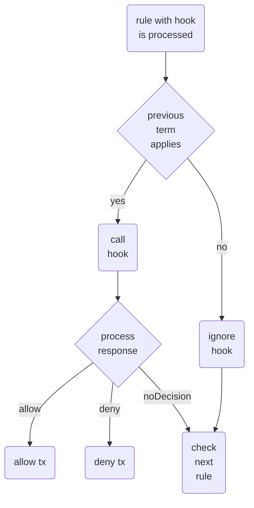

# Gas Station Server Access Controller

The **Gas Station Server** includes an **Access Controller** mechanism to manage access to the `/execute_tx` endpoint. This feature allows you to implement filtering logic based on properties derived from transactions. Currently, the Access Controller supports filtering based on the sender's address, enabling you to block or allow specific addresses.

## Access Controller Examples

- Disable All Requests and Allow Only a Specific Address

   The following configuration denies all incoming transactions except for move calls to package (`0x0202....`) originating from the specified sender address (`0x0101....`):

   ```yaml
   access-controller:
      access-policy: deny-all
      rules:
         - sender-address: "0x0101010101010101010101010101010101010101010101010101010101010101"
           move-call-package-address: "0x0202020202020202020202020202020202020202020202020202020202020202"
           action: 'allow' # allowed actions: 'allow', 'deny', a hook url (see "Hook Server" section)
   ```

---

- Enables All Requests and Deny Only a Specific Address

   The following configuration allows all incoming transactions except those from the specified sender address (`0x0101...`):

   ```yaml
   access-controller:
      access-policy: deny-all
      rules:
         - sender-address: "0x0101010101010101010101010101010101010101010101010101010101010101"
           action: 'deny'
   ```

---

- Gas Budget Constraints

   The following configuration denies all incoming transactions except those from the specified sender address (`0x0101...`) and the transaction gas budget below the limit `1000000`

   ```yaml
   access-controller:
      access-policy: deny-all
      rules:
         - sender-address: "0x0101010101010101010101010101010101010101010101010101010101010101"
           transaction-gas-budget: '<1000000' # allowed operators: =, !=, <, >, <=, >=
           action: 'allow'
   ```

---

- Advanced budgeting management

   The following configuration accept all incoming transactions with gas budget below `500000`. For address sender address (`0x0101...`) the allowed gas budget is increased to `1000000`

   ```yaml
   access-controller:
      access-policy: deny-all
      rules:
         - sender-address: "0x0101010101010101010101010101010101010101010101010101010101010101"
           transaction-gas-budget: '<=10000000'
           action: 'allow'

         - sender-address: '*'
           transaction-gas-budget: '<500000'
           action: 'allow'
   ```

---

- Programmable Transaction Command Count Limits

   To avoid users submitting transactions blocks with a large number of transactions, limits for the commands in the programmable transaction can be configured. In the following example, the sender may only submit up to one command in the programmable transaction.

   Note that this rule condition is only applied to transactions, that include a programmable transaction and will be ignored for other transaction kinds.

   ```yaml
   access-controller:
      access-policy: deny-all
      rules:
         - sender-address: "0x0101010101010101010101010101010101010101010101010101010101010101"
           ptb-command-count: <=1 # allowed operators: =, !=, <, >, <=, >=
           action: 'allow'
   ```

---

### Access Controller Rule syntax

|  parameter                  | mandatory  | possible values                                                |
|-----------------------------| -----------|----------------------------------------------------------------|
| `sender-address`            |  yes       | `'0x0000...'`, `[0x0000.., 0x1111...]`, `'*'`                  |
| `gas-budget`                |  no        | `'=100'`, `'<100'`,  `'<=100'`, `'>100'`, `'>=100'`, `'!=100'` |
| `move-call-package-address` |  no        | `'0x0000...'`, `[0x0000..., 0x1111...]`, `'*'`                 |
| `ptb-command-count`         |  no        | `'=10'`, `'<10'`,  `'<=10'`, `'>10'`, `'>=10'`, `'!=10'`       |
| `action`                    |  yes       | `'allow'`,  `'deny'`                                           |
| `gas_usage`                 |  no        | See [Gas Usage Limit](#gas-usage-limit-feature)                |

Below is a revised version of the documentation with improved grammar and clarity:

---

### Gas Usage Limit Feature

The **Gas Usage Limit** feature enables you to track gas consumption based on predefined parameters. When enabled, the gas tracking applies to the entire rule. The configuration syntax is:

```yaml
gas-usage:
  value: [range_of_numbers]
  window: [duration]
  count-by: [ sender-address ] # optional
```

> **Note:** The syntax of `duration` follows the specification used in the [`humantime`](https://docs.rs/humantime/latest/humantime/index.html) crate

#### Gas Usage Examples

Below are two examples that demonstrate how to enforce gas usage limits.

---

**1. Limit Gas Usage per Address**

This configuration sets a daily gas usage limit for a specific address. In the example below, the sender at address `0x0101...` is restricted to a maximum daily usage of `10000000` gas units.

The time window is reset not on a daily reset time, but 24 hours (as configured below) after the first transaction of sender at address `0x0101...`, allowing to have flexible usage based scheduling across different time zones.

> Note that gas usage for other addresses remains unconstrained.

```yaml
access-controller:
  access-policy: deny-all
  rules:
    - sender-address: "0x0101010101010101010101010101010101010101010101010101010101010101"
      gas-usage:
        value: '>1000000'
        window: 1 day
      action: 'deny'

    - sender-address: '*'
      action: 'allow'
```

---

**2. Limit Gas Usage per Address and Module**

In this example, the configuration restricts the daily gas usage for a specific address when calling a designated module. The sender at address `0x0101...` is limited to a maximum daily usage of `10000000` gas units when accessing package `0x0202...`. For all other interactions, gas usage is **blocked**.

```yaml
access-controller:
  access-policy: deny-all
  rules:
    - sender-address: "0x0101010101010101010101010101010101010101010101010101010101010101"
      move-call-package-address: "0x0202020202020202020202020202020202020202020202020202020202020202"
      gas-usage:
        value: '<1000000'
        window: 1 day
      action: 'allow'
```

---

**3. Limit Gas Usage per Address**

In this example, each user is limited to `10000000` gas units per day. The additional property `count-by` allows you to maintain individual counters for each `sender-address`. Without `count-by`, **all** users would share a daily limit of `1000000` gas units.

```yaml
access-controller:
  access-policy: deny-all
  rules:
    - sender-address: "*"
      gas-usage:
        value: '<1000000'
        window: 1 day
        count-by: [ sender-address ]
      action: 'allow'
```

### Hook Server

An external server (a hook), that decides whether a transaction should be executed or not can be configured. The hook receives the same input as the gas station allowing to parse inspect the transaction the same way, as the gas station does.

Hook server(s) can be configured as a term in the access controller rules, allowing to integrate hooks into existing rule sets or replacing the gas station built in access controller by a using hook only configuration.

Hooks are configured as values for the "action" keyword, by setting the `action` value to a URL instead of `allow`/`deny`. 

Hooks are the last thing that is called in an access controller rule (just before the gas usage check due to safety reasons). This reduces the amount of calls against a hook server and leads to a few possible scenarios as shown below.



A hook server has to follow the api spec defined [here](./openapi.json). Also an example server that can be used as a starting point for an own hook can be found in our [examples](../examples/hook).

---

- Hook only configuration

Having a single rule with a hook action replaces the access controller completely:

```yml
access-controller:
  access-policy: deny-all
  rules:
    - sender-address: "*"
      action: http://127.0.0.1:8080
```

or even shorter:

```yml
access-controller:
  access-policy: deny-all
  rules:
    - action: http://127.0.0.1:8080
```

---

As you usually might want to reduce the number of calls against the hook a bit, you can already apply access controller logic _before_ the hook is called (all other terms except `gas-usage` are checked before the hook call). To do so, add terms as documented above, for example:

```yml
   access-controller:
      access-policy: deny-all
      rules:
        - sender-address: "0x0101010101010101010101010101010101010101010101010101010101010101"
          transaction-gas-budget: '<1000000' # allowed operators: =, !=, <, >, <=, >=
          action: http://127.0.0.1:8080
```

---

Hook actions don't have to be used as standalone rules and can integrate seamlessly with other rules, e.g.

```yml
   access-controller:
      access-policy: deny-all
      rules:
        - sender-address: "0x0101010101010101010101010101010101010101010101010101010101010101"
          transaction-gas-budget: '<1000000'
          action: allow
        - action: http://127.0.0.1:8080
        - sender-address: "*"
          gas-usage:
            value: '<1000000'
            window: 1 day
            count-by: [ sender-address ]
```

As this might look a bit confusing, let's break this one down:

- we have a privileged address `0x0101010101010101010101010101010101010101010101010101010101010101`, that can send transaction below a certain threshold
- other addresses or larger transaction by the privileged address have to go trough a hook check
- the hook can then react with:
  - allowing the transaction
  - denying the transaction
  - letting the next rule decide if the transaction should be executed or not
- assuming, the hook decides not to decide about the transaction, we would now check the sender address based gas usage and decide based on this if the transaction is executed or not

## Learn More

For more information about how the rules are processed, please refer to [this link](https://docs.iota.org/operator/gas-station/architecture/features#access-controller).
